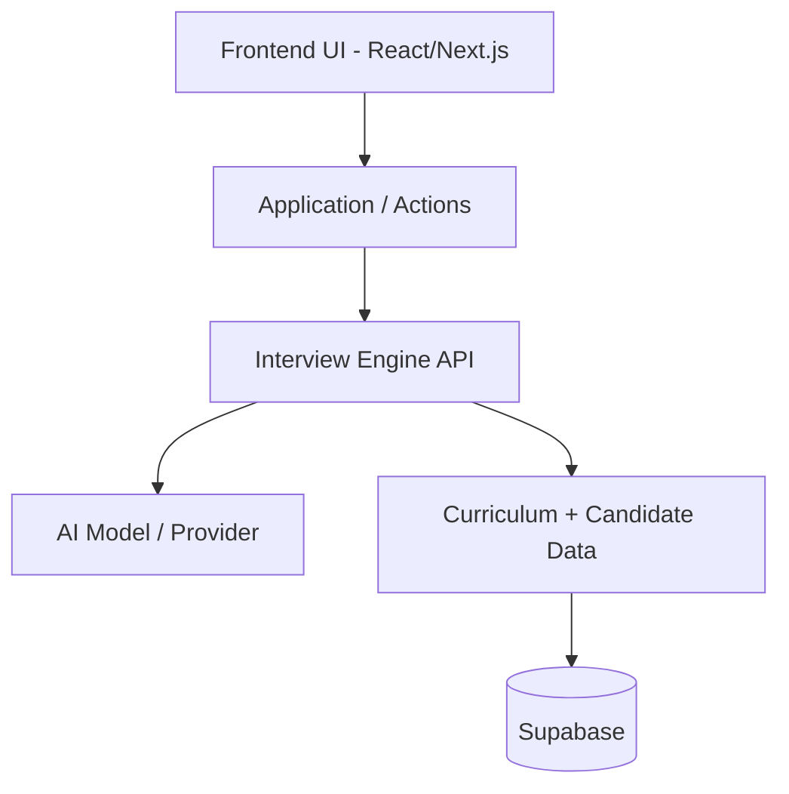

# Architecture

## High-Level Architecture

Intervu separates the Frontend (Presentation Layer) from the Backend (Interview Engine & State) to allow independent development and clear integration contracts.

## System Responsibilities

### Frontend (Owned by Kirtan)
- **Role**: Pure presentation, rendering, and user interaction.
- **Responsibilities**:
  - Stitch-driven premium design implementation.
  - UI state management (loading states, transitions).
  - Navigation and routing.
  - Animations (micro-interactions, polished transitions).
  - Accessibility (a11y).
  - Consuming backend API contracts.
- **Constraint**: The frontend must **NOT** contain interview intelligence, scoring logic, or AI prompt generation.

### Backend (Owned by Ayaan)
- **Role**: Core intelligence, data persistence, and API.
- **Responsibilities**:
  - Supabase integration and database schema ownership.
  - Interview engine orchestration.
  - Curriculum retrieval and candidate data retrieval.
  - Prompt generation and AI provider integration.
  - Question and adaptive follow-up generation.
  - Conversation state management.
  - Candidate evaluation and scoring.
  - Report generation.
  - API endpoint exposition for the frontend.

## Integration & Contracts
- The frontend will rely on predefined Mock data/types until the backend endpoints are ready.
- Both systems will agree on strict JSON contracts defined in `docs/API.md`.
